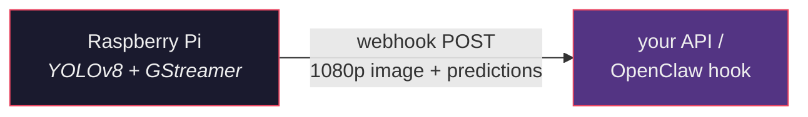
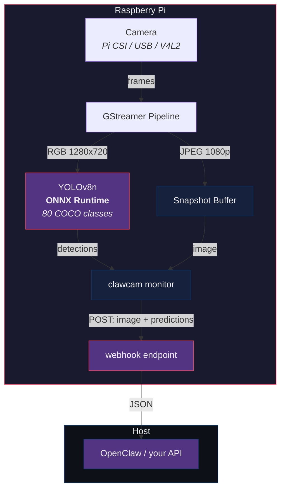

<div align="center">


**AI-powered camera monitoring for Raspberry Pi**

[](LICENSE)
[](Cargo.toml)

*Any camera. On-device YOLO. 1080p snapshots. Structured predictions. No cloud.*



</div>

---

### 🤖 Install via AI Agent

Send this to your AI agent:

> Read https://raw.githubusercontent.com/grunt3714-lgtm/clawcam/master/SKILL.md and install the clawcam skill. Run the installer:
> ```
> curl -fsSL https://raw.githubusercontent.com/grunt3714-lgtm/clawcam/master/skill-install.sh | bash
> ```

<details>
<summary>👤 Manual install</summary>

```sh
curl -fsSL https://raw.githubusercontent.com/grunt3714-lgtm/clawcam/master/install.sh | bash
```

</details>

---

`clawcam` SSHes into your Raspberry Pi, deploys a monitor binary with a YOLOv8n model, and pushes detection events directly to your webhook. GStreamer captures frames from any connected camera — **Pi Camera Module**, **USB webcam**, or **conference camera**. YOLO runs inference on-device and webhooks fire with a 1080p snapshot and structured predictions.

### Highlights

- **Camera-agnostic** — Pi Camera Module (libcamera), USB webcams, conference cams (V4L2)
- **On-device YOLO** — YOLOv8n via ONNX Runtime, no cloud inference
- **80 detection classes** — full COCO set (person, car, dog, cat, bicycle, etc.)
- **1080p snapshots** — full-resolution JPEG captured at the moment of detection
- **Structured predictions** — class, confidence score, and bounding box for each detection
- **Device registry** — name your cameras, manage them by friendly name
- **Zero device setup** — `clawcam setup <name>` handles everything over SSH
- **Boot persistence** — systemd service auto-starts on reboot
- **Cloud-free** — all detection runs locally, events stay on your network

## Install

```sh
git clone https://github.com/grunt3714-lgtm/clawcam.git
cd clawcam
cargo build --release
```

Cross-compile for Raspberry Pi:

```sh
# Pi 4/5 (64-bit)
cargo build --release --target aarch64-unknown-linux-gnu

# Pi 3/Zero 2 (32-bit)
cargo build --release --target armv7-unknown-linux-gnueabihf
```

Download the YOLO model:

```sh
mkdir -p models
# YOLOv8n — fast, good for Pi
wget -O models/yolov8n.onnx https://github.com/ultralytics/assets/releases/download/v8.2.0/yolov8n.onnx
```

Requires: Rust 2024 edition, SSH key access to `pi@<device>`, GStreamer dev libraries on host for compilation.

## Quick start

```sh
# Register your Pi camera
clawcam device add barn-cam 192.168.1.50

# Deploy monitor with webhook — Pi pushes events directly
clawcam setup barn-cam \
  --webhook http://your-host:8080/hooks/clawcam \
  --webhook-token YOUR_TOKEN
```

That's it. The Pi will POST detection events with a 1080p snapshot and YOLO predictions to your endpoint.

## Webhook payload

When a detection occurs, the Pi runs YOLO inference and POSTs:

```json
{
  "ts": "Apr 17 14:30:45",
  "epoch": 1776437445,
  "type": "motion",
  "detail": "ai_detected",
  "source": "clawcam",
  "host": "192.168.1.50",
  "image": "<base64 1080p JPEG>",
  "predictions": [
    {
      "class": "person",
      "class_id": 0,
      "score": 0.87,
      "left": 120,
      "top": 80,
      "right": 320,
      "bottom": 430
    }
  ]
}
```

## Commands

| Command | Description |
|---------|-------------|
| `device add NAME HOST` | Register a new Pi camera |
| `device list` | List all registered devices |
| `device remove NAME` | Remove a device from the registry |
| `setup NAME` | Deploy monitor + YOLO model (with `--webhook`) |
| `status NAME` | Check device health, camera, model, resources |
| `snap NAME` | Capture a JPEG snapshot |
| `clip NAME` | Record a short MP4 clip |
| `speak NAME MSG` | Play TTS through the device speaker |
| `listen NAME` | Record audio from the device microphone |
| `teardown NAME` | Stop the monitor and clean up |

### `device add`

```
$ clawcam device add barn-cam 192.168.1.50
added device 'barn-cam' at 192.168.1.50:22

$ clawcam device list
NAME             HOST                 PORT   USER
barn-cam         192.168.1.50         22     pi
garage-cam       192.168.1.51         22     pi
```

### `setup NAME`

```
$ clawcam setup barn-cam --webhook http://your-host:8080/events
setting up barn-cam (192.168.1.50)
installing system dependencies...
detecting camera...
detected camera source: v4l2src device=/dev/video0
deploying clawcam binary...
deployed: clawcam 0.1.0
deploying YOLO model...
creating systemd service...
setup complete — clawcam is active on barn-cam
```

Flags:
- `--webhook URL` — Pi POSTs events directly to this URL
- `--webhook-token TOKEN` — Bearer token for webhook auth
- `--user` — SSH user (default: pi)

### `snap NAME` / `clip NAME`

```sh
clawcam snap barn-cam --out shot.jpg
clawcam clip barn-cam --dur 10 --out clip.mp4
```

## How it works



1. **GStreamer** captures frames from the connected camera (auto-detected)
2. Frames are split: RGB for inference, JPEG for snapshots
3. **YOLOv8n** runs inference via ONNX Runtime (~2 FPS on Pi 4)
4. When objects are detected above the confidence threshold, `clawcam monitor` fires a webhook
5. The webhook includes the **1080p JPEG** and structured predictions with bounding boxes
6. A **3-second cooldown** prevents rapid-fire duplicate events

### Supported cameras

| Camera Type | GStreamer Source | Auto-detected |
|-------------|----------------|---------------|
| Pi Camera Module (v1/v2/v3) | `libcamerasrc` | Yes |
| USB webcam | `v4l2src device=/dev/video0` | Yes |
| USB conference camera | `v4l2src device=/dev/video0` | Yes |
| Network/RTSP camera | `rtspsrc location=rtsp://...` | No (set `CLAWCAM_CAMERA_SOURCE`) |

### Detection classes (COCO)

Full 80-class COCO set. Most relevant for monitoring:

| Class | ID | Class | ID |
|-------|----|-------|----|
| person | 0 | car | 2 |
| bicycle | 1 | motorcycle | 3 |
| bus | 5 | truck | 7 |
| bird | 14 | cat | 15 |
| dog | 16 | backpack | 24 |

## On-device architecture

| Component | Role |
|-----------|------|
| **GStreamer** | Camera capture, frame scaling, JPEG encoding |
| **ONNX Runtime** | YOLOv8n inference on CPU |
| **clawcam monitor** | Detection loop, webhook dispatch, cooldown |
| **systemd** | Service management, boot persistence, auto-restart |

### File layout on device

| Path | Description |
|------|-------------|
| `/usr/local/bin/clawcam` | Monitor binary |
| `/usr/local/share/clawcam/yolov8n.onnx` | YOLO model |
| `/etc/systemd/system/clawcam.service` | systemd unit |
| `/var/log/clawcam.log` | Monitor log |

## License

MIT
